<h1 align="center">DOKUMENTACJA projektu CdStore</h1>

<h2>Ogólny opis</h2>

CdStore to prosty sklep internetowy z płytami CD zbudowany w ASP.NET Core Razor Pages / MVC (razor views) na platformie .NET 8. Projekt wykorzystuje Identity do obsługi użytkowników, Entity Framework Core do warstwy dostępu do danych oraz migracje EF do zarządzania schemą bazy danych. Zawiera mechanikę koszyka, zamówień, ulubionych, panel konta oraz proste zarządzanie użytkownikami.

<h3>Wymagania</h3>

- .NET 8 SDK
- SQL Server (lub inny provider skonfigurowany w appsettings.json)
- Dotnet-ef (opcjonalnie, do stosowania migracji lokalnie)

<h3>Struktura projektu (najważniejsze pliki i katalogi)</h3>

- Program.cs — konfiguracja aplikacji i usług.
- appsettings.json — ustawienia aplikacji, w tym connection string.
- CdStore/Services/ApplicationDbContext.cs — DbContext aplikacji i konfiguracja encji.
- CdStore/Services/SeedService.cs — serwis do seedowania danych początkowych.
- CdStore/Models — modele domenowe, najważniejsze pliki:
  - Users.cs — rozszerzenie IdentityUser (FullName, IsBlocked, DeliveryAddress).
  - Album.cs, Kategoria.cs — encje produktów i kategorii.
  - CartItem.cs, Order.cs, OrderItem.cs, Receipt.cs, Favorite.cs — encje koszyka/zamówień/paragonów/ulubionych.
  - OrderStatus.cs — statusy zamówień.
- CdStore/Controllers — kontrolery MVC:
  - AccountController.cs — logowanie, rejestracja, profil, zmiana hasła, lista użytkowników itp.
  - HomeController.cs — strony główne, przegląd, szczegóły, koszyk.
  - OrderController.cs — obsługa procesu zamówienia i widoków zamówień.
- CdStore/Views — widoki Razor dla akcji kontrolerów (layout, partials, widoki akcji).
- CdStore/Services/CartService.cs — logika koszyka przechowywana po stronie serwisu.
- CdStore/Migrations — wygenerowane migracje EF.

<h3>Główne funkcjonalności</h3>

- Rejestracja i logowanie użytkowników (ASP.NET Core Identity). Model Users rozszerza IdentityUser o pola FullName, IsBlocked (blokowanie użytkownika) oraz DeliveryAddress.
- Przeglądanie katalogu albumów i kategorii.
- Dodawanie produktów do koszyka oraz zarządzanie koszykiem (CartService).
- Tworzenie zamówień, przeglądanie historii zamówień i generowanie paragonów/receipt.
- Ulubione (Favorite) dla użytkowników.
- Seedowanie przykładowych danych (SeedService) i migracje EF do tworzenia schematu bazy.

<h2>Przykłady kodu — rzeczywiste wycinki z projektu</h2>

<h3>1) Program.cs — rejestracja DbContext, Identity i serwisów</h3>
<p>Wyciąg z pliku CdStore/Program.cs — pokazuje jak skonfigurowane są usługi aplikacji (DbContext, Identity, Cookie, rejestracja serwisów i seedowanie bazy):</p>

```csharp
using CdStore.Models;
using CdStore.Services;
using Microsoft.AspNetCore.Identity;
using Microsoft.EntityFrameworkCore;
using QuestPDF.Infrastructure;

var builder = WebApplication.CreateBuilder(args);

builder.Services.AddControllersWithViews();
builder.Services.AddDbContext<ApplicationDbContext>(options =>
{
    var connectionString = builder.Configuration.GetConnectionString("DefaultConnection");
    options.UseSqlServer(connectionString);
});
builder.Services.AddScoped<CdStore.Services.CartService>();
builder.Services.AddIdentity<Users, IdentityRole>(options =>
{
    options.Password.RequiredLength = 8;
    options.Password.RequireDigit = true;
    options.Password.RequireLowercase = true;
    options.Password.RequireUppercase = true;
    options.User.RequireUniqueEmail = true;
    options.SignIn.RequireConfirmedEmail = false;
    options.SignIn.RequireConfirmedAccount = false;
    options.SignIn.RequireConfirmedPhoneNumber = false;
})
    .AddEntityFrameworkStores<ApplicationDbContext>()
    .AddDefaultTokenProviders();

builder.Services.ConfigureApplicationCookie(options =>
{
    options.Cookie.HttpOnly = true;
    options.Cookie.IsEssential = true;
    options.ExpireTimeSpan = TimeSpan.FromHours(8);
    options.SlidingExpiration = true;
});

QuestPDF.Settings.License = LicenseType.Community;

var app = builder.Build();

await SeedService.SeedDatabase(app.Services);
```

<h3>2) ApplicationDbContext — rzeczywisty DbContext z projektu</h3>
<p>Wyciąg z CdStore/Services/ApplicationDbContext.cs — definicje DbSetów używanych w aplikacji:</p>

```csharp
using CdStore.Models;
using Microsoft.AspNetCore.Identity.EntityFrameworkCore;
using Microsoft.EntityFrameworkCore;

public class ApplicationDbContext : IdentityDbContext<Users>
{
    public ApplicationDbContext(DbContextOptions options) : base(options)
    {
    }

    public DbSet<Album> Albumy { get; set; } = null!;
    public DbSet<CartItem> CartItems { get; set; } = null!;
    public DbSet<Kategoria> Kategorie { get; set; }
    public DbSet<Order> Orders { get; set; }
    public DbSet<OrderItem> OrderItems { get; set; }
    public DbSet<Favorite> Favorites { get; set; }
    public DbSet<Receipt> Receipts { get; set; }
}
```

<h3>3) Model Users — faktyczny model z projektu</h3>
<p>Wyciąg z CdStore/Models/Users.cs — dodatkowe pola powiązane z użytkownikiem:</p>

```csharp
using Microsoft.AspNetCore.Identity;
using System.ComponentModel.DataAnnotations;

public class Users : IdentityUser
{
    [MaxLength(200)]
    public string FullName { get; set; }

    public bool IsBlocked { get; set; } = false;

    [MaxLength(300)]
    public string DeliveryAddress { get; set; }
}
```

<h3>4) CartService — fragmenty implementacji z projektu</h3>
<p>Wyciąg z CdStore/Services/CartService.cs — pokazany jest rzeczywisty kod metody dodającej pozycję do koszyka:</p>

```csharp
public bool Add(string cartId, int albumId, int quantity = 1)
{
    if (string.IsNullOrEmpty(cartId)) return false;
    if (quantity <= 0) return false;

    var album = _db.Albumy.Find(albumId);
    if (album == null) return false;

    var maxAllowed = Math.Min(5, album.IloscNaStanie);
    if (maxAllowed <= 0) return false;

    var existing = _db.CartItems.FirstOrDefault(ci => ci.CartId == cartId && ci.AlbumId == albumId);
    if (existing == null)
    {
        var qty = Math.Min(quantity, maxAllowed);
        _db.CartItems.Add(new CartItem { CartId = cartId, AlbumId = albumId, Quantity = qty });
    }
    else
    {
        var newQty = existing.Quantity + quantity;
        existing.Quantity = Math.Min(newQty, maxAllowed);
        _db.CartItems.Update(existing);
    }

    _db.SaveChanges();
    return true;
}
```

<h3>5) Checkout i zapis zamówienia — fragment z OrderController</h3>
<p>Wyciąg z CdStore/Controllers/OrderController.cs — fragment POST Checkout, który tworzy Order i OrderItemy oraz aktualizuje stany magazynowe:</p>

```csharp
var order = new Order
{
    UserId = userId,
    FirstName = model.FirstName,
    LastName = model.LastName,
    Address = model.Address,
    Phone = model.Phone,
    Email = model.Email,
    CreatedAt = DateTime.UtcNow,
    IsPaid = false,
    Total = cartItems.Sum(a => a.Cena * (ids2Detailed.First(ci => ci.AlbumId == a.Id).Quantity))
};

foreach (var album in cartItems)
{
    var qty = ids2Detailed.First(ci => ci.AlbumId == album.Id).Quantity;
    order.Items.Add(new OrderItem
    {
        AlbumId = album.Id,
        Quantity = qty,
        UnitPrice = album.Cena
    });

    album.IloscNaStanie -= qty;
}

_context.Orders.Add(order);
_context.SaveChanges();

_cartService.Clear(cartId2);
```

<h3>6) Opłacenie zamówienia i generowanie paragonu (PDF)</h3>
<p>Wyciąg z OrderController — metoda Pay oznacza zamówienie jako opłacone, tworzy Receipt, a DownloadReceipt generuje PDF przy użyciu QuestPDF:</p>

```csharp
// ustawienie płatności
order.IsPaid = true;

var receipt = new Receipt
{
    OrderId = order.Id,
    Number = $"R-{order.Id}-{DateTime.UtcNow:yyyyMMddHHmmss}",
    PaymentMethod = Enum.Parse<PaymentMethod>(method)
};

_context.Receipts.Add(receipt);
_context.SaveChanges();
```

```csharp
// generowanie PDF (wycinek)
var pdfBytes = doc.GeneratePdf();
var fileName = $"Paragon_{receipt.Number}.pdf";
return File(pdfBytes, "application/pdf", fileName);
```

<h3>7) Connection string — aktualny w projekcie (appsettings.json)</h3>

```json
"ConnectionStrings": {
  "DefaultConnection": "Data Source=.\\SQLEXPRESS;Initial Catalog=cdstoredb;Integrated Security=True;TrustServerCertificate=True"
}
```

<h2>Spis funkcji — kontrolery i serwisy</h2>

<p>Poniżej znajduje się lista publicznych akcji i istotnych helperów w głównych kontrolerach i serwisie CartService wraz z krótkimi opisami działania.</p>

<h3>AccountController</h3>
<ul>
  <li><strong>GetUserId()</strong> (private) — pobiera Id zalogowanego użytkownika z Claimów.</li>
  <li><strong>Orders()</strong> — (GET) zwraca listę zamówień aktualnego użytkownika (Include Items, Receipt); Challenge() gdy brak logowania.</li>
  <li><strong>Login()</strong> — (GET) widok logowania.</li>
  <li><strong>Login(LoginViewModel)</strong> — (POST) loguje użytkownika; przy sukcesie scala anonimowy koszyk (cookie) z koszykiem użytkownika i usuwa cookie; zwraca błędy w ModelState przy niepowodzeniu.</li>
  <li><strong>Register()</strong> — (GET) widok rejestracji.</li>
  <li><strong>Register(RegisterViewModel)</strong> — (POST) tworzy konto Users, tworzy rolę "User" jeśli brak, przypisuje rolę, loguje użytkownika i scala anonimowy koszyk; obsługuje błędy tworzenia.</li>
  <li><strong>Logout()</strong> — (POST) wylogowuje użytkownika i przekierowuje na Home.</li>
  <li><strong>ToggleBlock(string id)</strong> — (POST, Admin) przełącza IsBlocked dla użytkownika; nie pozwala zablokować Admina.</li>
  <li><strong>MakeAdmin(string id)</strong> — (POST, Admin) tworzy rolę Admin (jeśli brak) i nadaje ją użytkownikowi; odblokowuje użytkownika jeśli był zablokowany.</li>
  <li><strong>RemoveAdmin(string id)</strong> — (POST, Admin) usuwa rolę Admin z użytkownika.</li>
  <li><strong>Profile()</strong> — (GET, Authorize) widok profilu aktualnego użytkownika.</li>
  <li><strong>UsersList()</strong> — (GET, Admin) lista wszystkich użytkowników.</li>
  <li><strong>Profile(Users model)</strong> — (POST) aktualizuje dane aktualnego użytkownika (FullName, Email, Phone, DeliveryAddress) i zapisuje zmiany.</li>
  <li><strong>ChangePassword()</strong> — (GET) widok zmiany hasła.</li>
  <li><strong>ChangePassword(ChangePasswordViewModel)</strong> — (POST) zmienia hasło i odświeża sesję (RefreshSignInAsync); obsługuje błędy.</li>
</ul>

<h3>HomeController</h3>
<ul>
  <li><strong>GetOrCreateCartId()</strong> (private) — zwraca cartId: userId jeśli zalogowany, wpp. cookie CartId; tworzy cookie gdy brak.</li>
  <li><strong>IsCurrentUserBlocked()</strong> (private) — sprawdza flagę IsBlocked aktualnego użytkownika w DB.</li>
  <li><strong>Index(IndexHomeVm)</strong> — (AllowAnonymous) ładuje listę albumów z filtrami (kategoria, dostępność), sortowaniem, kategorie, ulubione i identyfikatory w koszyku.</li>
  <li><strong>Detale(int id)</strong> — (AllowAnonymous) ładuje szczegóły albumu i przygotowuje dane koszyka oraz ulubionych.</li>
  <li><strong>Regulamin(), PolitykaPrywatnosci()</strong> — (AllowAnonymous) statyczne strony informacyjne.</li>
  <li><strong>Privacy(int? id)</strong> — (Admin) panel admina do przeglądu i edycji produktów; ładuje albumy i kategorie.</li>
  <li><strong>SaveProductForm(Album model)</strong> — (POST, Admin) tworzy lub aktualizuje album; parsuje cenę, normalizuje opis i zapisuje zmiany.</li>
  <li><strong>DeleteProductForm(int id)</strong> — (POST, Admin) usuwa album.</li>
  <li><strong>Gatunki(int? id)</strong> — (Admin) widok listy kategorii.</li>
  <li><strong>SaveCategoryForm(Kategoria model)</strong> — (POST, Admin) tworzy lub aktualizuje kategorię.</li>
  <li><strong>DeleteCategoryForm(int id)</strong> — (POST, Admin) usuwa kategorię.</li>
  <li><strong>Koszyk()</strong> — pokazuje zawartość koszyka: pobiera szczegóły z CartService, przygotowuje mapę ilości i flagę IsBlocked.</li>
  <li><strong>AddToCart(int albumId, int quantity = 1)</strong> — (POST) dodaje pozycję do koszyka przez CartService; sprawdza blokadę konta; zwraca JSON { success }.</li>
  <li><strong>RemoveFromCart(int albumId)</strong> — (POST) usuwa pozycję przez CartService; zwraca JSON.</li>
  <li><strong>ClearCart()</strong> — (POST) czyści koszyk przez CartService; zwraca JSON.</li>
  <li><strong>Buy()</strong> — (POST) realizuje szybką finalizację zakupu: waliduje dostępność i limity (max 5), zmniejsza IloscNaStanie, zapisuje zmiany i czyści koszyk; zwraca JSON z wynikiem.</li>
  <li><strong>UpdateCartQuantity(int albumId, int quantity)</strong> — (POST) ustawia ilość przez CartService.SetQuantity (ogranicza do maxAllowed), oblicza subtotal i total i zwraca JSON.</li>
  <li><strong>Favorites()</strong> — lista ulubionych zalogowanego użytkownika, wraz z danymi koszyka.</li>
  <li><strong>AddToFavorites(int albumId)</strong> — (POST) dodaje wpis Favorite, jeśli użytkownik zalogowany i wpis nie istnieje; zwraca JSON.</li>
  <li><strong>RemoveFromFavorites(int albumId)</strong> — (POST) usuwa wpis Favorite; zwraca JSON.</li>
  <li><strong>Error()</strong> — widok błędu z RequestId.</li>
</ul>

<h3>OrderController</h3>
<ul>
  <li><strong>GetUserId()</strong> (private) — pobiera Id użytkownika z Claimów.</li>
  <li><strong>IsUserBlocked(string userId)</strong> (private) — sprawdza flagę IsBlocked dla podanego userId.</li>
  <li><strong>Checkout()</strong> — (GET, Authorize) przygotowuje CheckoutVm: ładuje zawartość koszyka, mapę ilości, dane użytkownika i oblicza total; przy zablokowanym koncie przekierowuje do Koszyk z TempData error.</li>
  <li><strong>Checkout(CheckoutVm model)</strong> — (POST) waliduje koszyk i dostępność, tworzy Order i OrderItemy, zmniejsza stany magazynowe, zapisuje do DB i czyści koszyk; przekierowuje do OrderSummary.</li>
  <li><strong>OrderSummary(int id)</strong> — ładuje zamówienie (Items -> Album, Receipt) i sprawdza uprawnienia (właściciel lub admin); zwraca widok podsumowania.</li>
  <li><strong>Pay(int id, string method = "Card")</strong> — (POST) weryfikuje własność i blokady, oznacza zamówienie jako opłacone, tworzy Receipt i zapisuje; zwraca JSON (symulacja płatności).</li>
  <li><strong>AllOrders()</strong> — (Admin) zwraca listę wszystkich zamówień (Items->Album, User) posortowanych malejąco.</li>
  <li><strong>ChangeStatus(int id, string status)</strong> — (POST, Admin) mapuje tekstowy status na enum OrderStatus i aktualizuje order.Status; przy Dostarczone ustawia DeliveryDate.</li>
  <li><strong>TryMapStringToStatus(string s, out OrderStatus status)</strong> (private) — pomocnik mapujący polski tekst na OrderStatus.</li>
  <li><strong>DownloadReceipt(int id)</strong> — (GET) generuje PDF paragonu przy użyciu QuestPDF i zwraca plik; sprawdza uprawnienia (właściciel lub admin).</li>
</ul>

<h3>CartService</h3>
<ul>
  <li><strong>CartService(ApplicationDbContext)</strong> — konstruktor (DI kontekstu).</li>
  <li><strong>Add(string cartId, int albumId, int quantity = 1)</strong> — dodaje pozycję do koszyka lub zwiększa ilość; waliduje cartId, quantity, istnienie albumu; stosuje maxAllowed = min(5, IloscNaStanie); zapisuje do DB i zwraca bool sukcesu.</li>
  <li><strong>Remove(string cartId, int albumId)</strong> — usuwa wpisy CartItem dla danego cartId i albumId; zapisuje zmiany.</li>
  <li><strong>GetCartItems(string cartId)</strong> — zwraca listę albumId z koszyka (distinct), tylko quantity &gt; 0.</li>
  <li><strong>GetCartItemsDetailed(string cartId)</strong> — zwraca listę CartItem; przed zwróceniem usuwa wpisy z quantity &lt;= 0 i zapisuje zmiany, potem zwraca aktualne wpisy.</li>
  <li><strong>SetQuantity(string cartId, int albumId, int quantity)</strong> — ustawia ilość pozycji (usuwa gdy &lt;=0), stosuje ograniczenie do maxAllowed, zapisuje i zwraca bool.</li>
  <li><strong>Clear(string cartId)</strong> — usuwa wszystkie wpisy danego cartId i zapisuje zmiany.</li>
</ul>

<p><em>Uwagi:</em> Metody modyfikujące stan magazynowy i tworzące zamówienia wykonują SaveChanges() bez explicite transakcji. W środowisku o dużej współbieżności rozważ użycie transakcji DB lub mechanizmów kontroli współbieżności.</p>

<h2>Operacje użytkownika — krok po kroku (bez kodu)</h2>

<p>W tej sekcji znajdują się opisy kroków, jakie wykonuje użytkownik w aplikacji. Nie ma tu fragmentów kodu — tylko instrukcje operacyjne.</p>

<h3>Rejestracja konta</h3>
<p>Wypełnij formularz rejestracji (Email, Hasło, Imię i nazwisko) i zatwierdź. Po rejestracji konto jest utworzone i użytkownik może się zalogować.</p>
<p>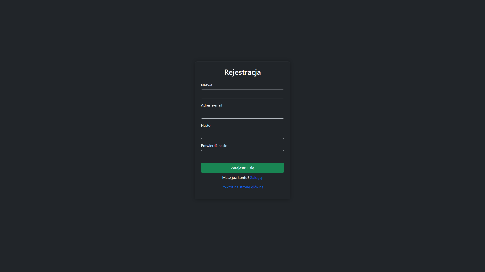</p>

<h3>Logowanie</h3>
<p>Wypełnij formularz logowania (Email, Hasło) i zatwierdź, aby uzyskać dostęp do konta i funkcji chronionych.</p>
<p></p>

<h3>Zmiana danych osobowych</h3>
<p>Pozwala użytkownikowi zaktualizować swoje dane (Imię i nazwisko, adres dostawy, numer telefonu).</p> 
<p>Aby przejść do profilu należy rozwinąć listę w prawym górnym rogu ekranu i wcisnąć przycisk "Profil".</p>
<p></p>
<p>Wyświetli się formularz, w którym można zmienić dane osobowe oraz opcja zmiany hasła.</p>
<p>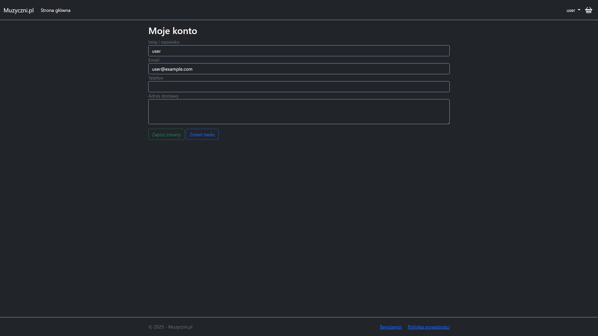</p>

<h3>Strona główna</h3>
<p>Strona główna, to strona z wszystkimi albumami, z jej poziomu można zobaczyć szczegóły danego albumu, filtrować wyniki, dodać album do koszyka oraz do ulubionych.</p>
<p>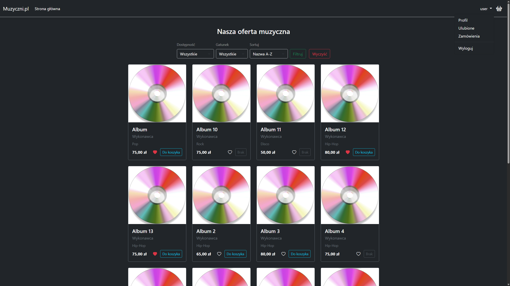</p>
<p>Nad widokiem albumów znajdują się opcje filtrowani.a</p>
<p>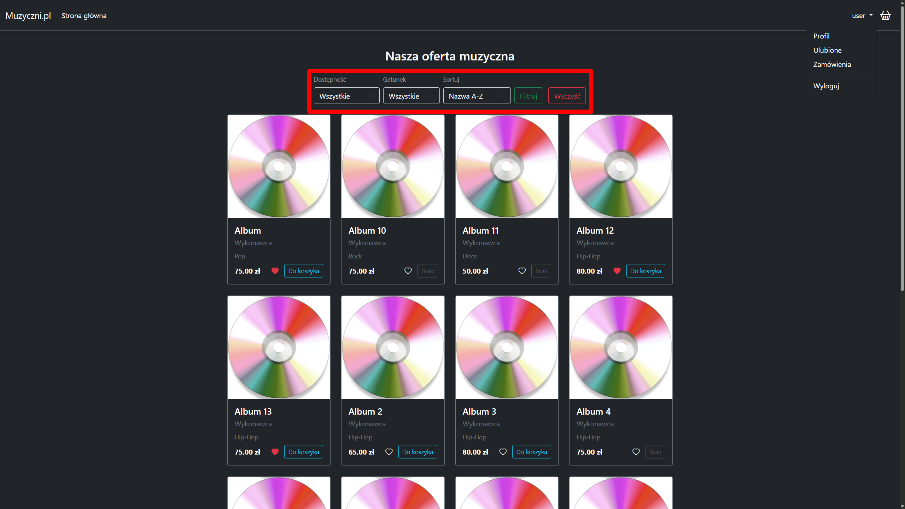</p>
<p>Aby zobaczyć szczegóły i okładkę albumu, należy kliknąć w dowolne miejsce na jego karcie produktu.</p>
<p>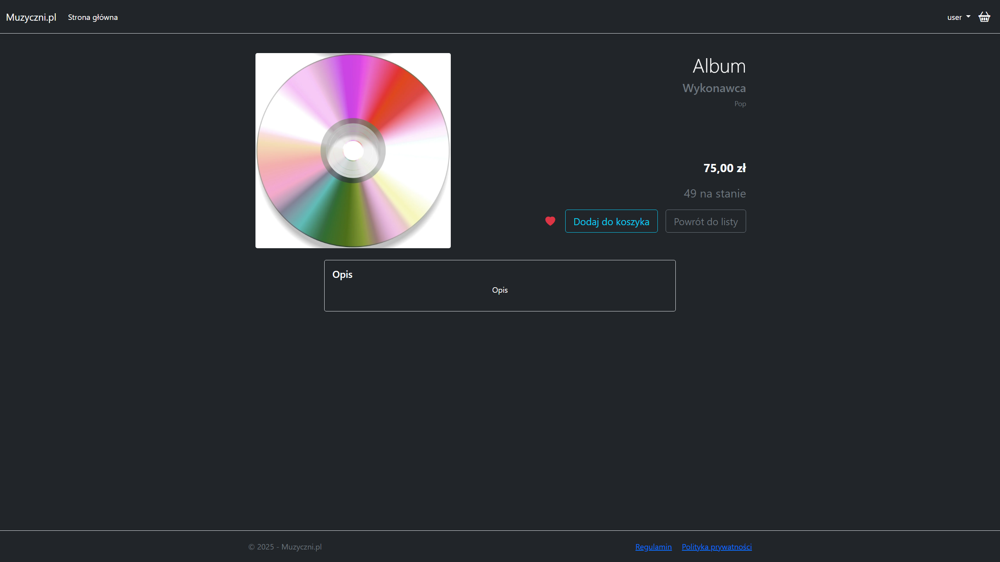</p>
<p>Aby dodać album do koszyka, kliknij w przycisk "Do koszyka", a aby wyświetlić koszyk, kliknij w ikonkę koszyka w prawym górnym rogu ekranu.</p>
<p>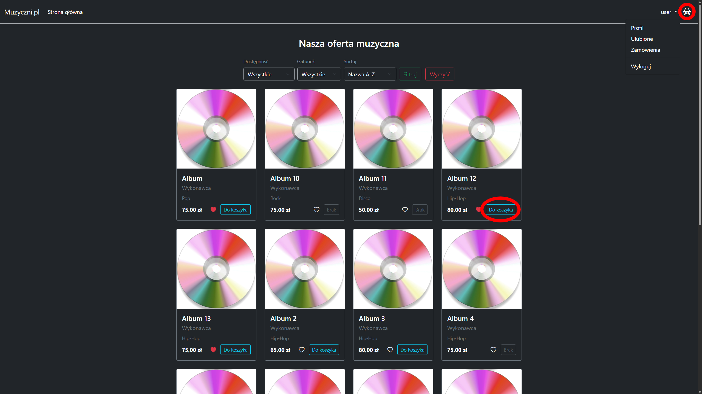</p>
<p>Widok koszyka</p>
<p>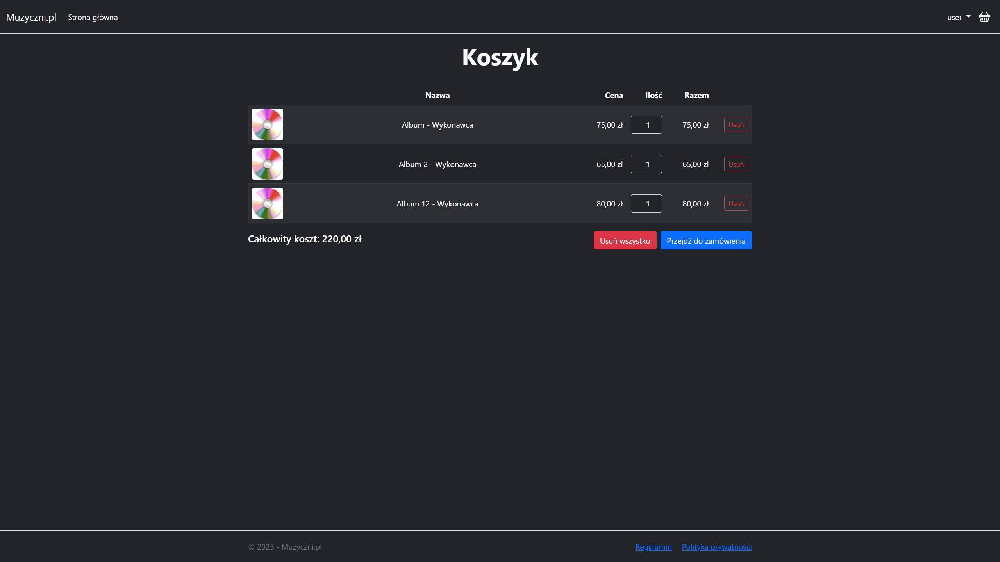</p>
<p>Aby dodać album do ulubionych, kliknij w ikonę serduszka obok albumu. Aby wyświetlić ulubione, rozwiń listę w prawym górnym rogu ekranu i kliknij w napis "Ulubione".</p>
<p>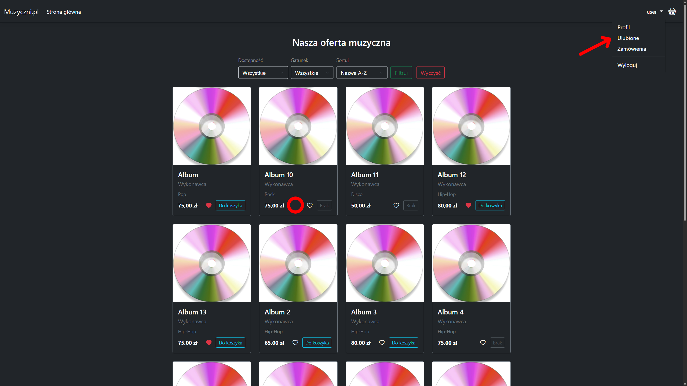</p>
<p>Widok ulubioncyh</p>
<p>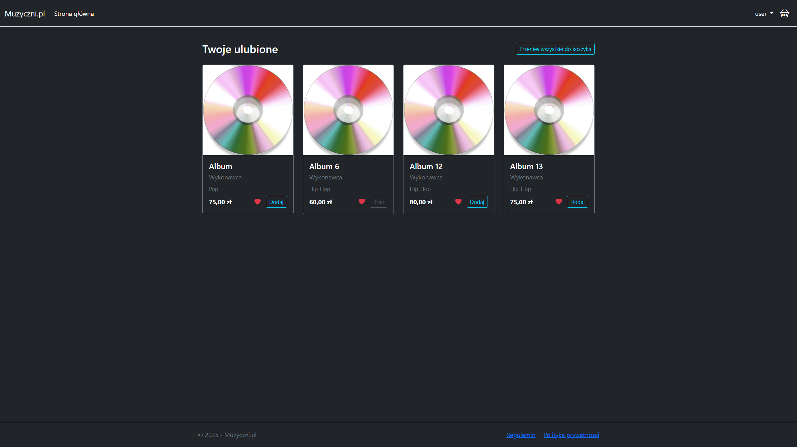</p>

<h3>Zarządzanie koszykiem</h3>
<p>W widoku koszyka dla użytkownika jest dostępnych kilka akcji</p> <br>
<p>Pierwsza z nich to zmiana ilości kupowanego produktu. Aby to zrobić należy użyć strzałek obok ilości wybranego produktu</p>
<p></p>
<p>Użytkownik może też usunąć przedmiot z koszyka klikając czerwony przycisk "Usuń" po prawej stronie koszyka, lub przycisk "Usuń wszystko" pod produktami by wyczyścić cały koszyk.</p> <br>
<p>Ostatnią akcją jaką może wykonać użytkownik jest przejście do podsumowania zamówienia. Aby to zrobić należy kliknąć niebieski przycisk "Przejdź do zamówienia" pod produktami</p>
<p>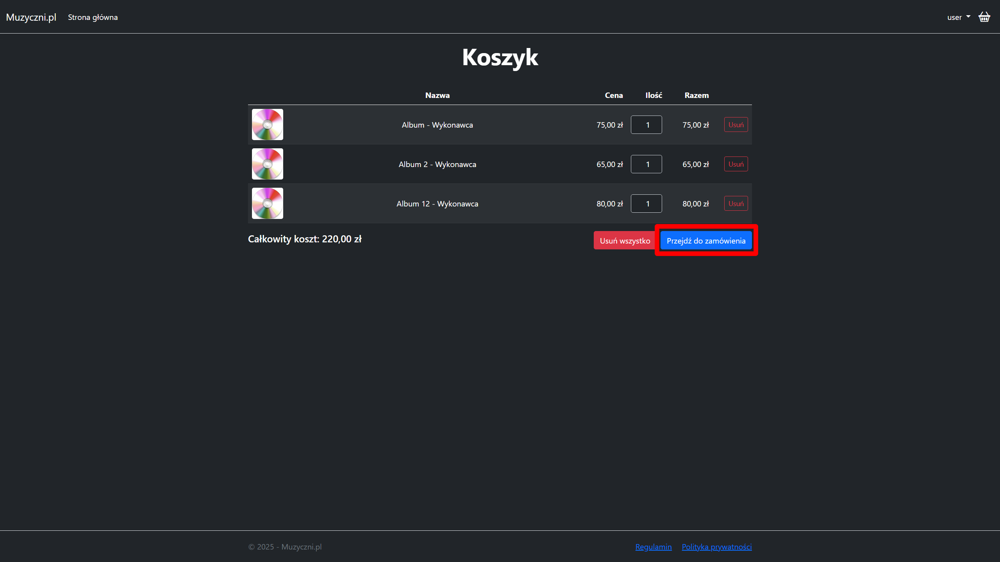</p>

<h3>Złożenie zamówienia</h3>
<p>Po przejściu do podsumowania zamówienia, użytkownik zobaczy formularz, w którym musi wypełnić swoje dane osobowe, jeśli jeszcze tego nie zrobił w profilu.</p>
<p>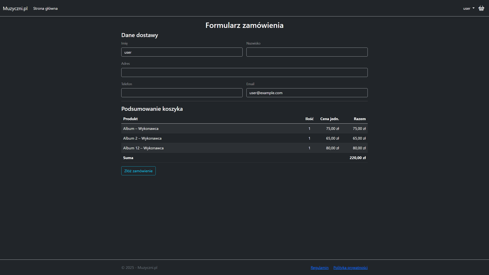</p>
<p>Po wypełnieniu danych, należy kliknąć przycisk "Złóż zamówienie", by przejść dalej.</p>
<p>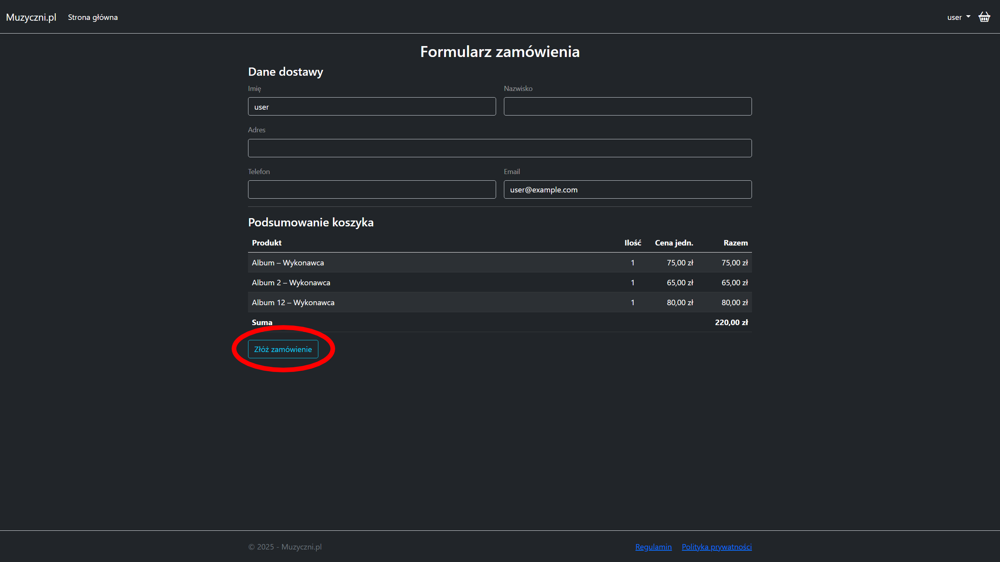</p>
<p>Po złożeniu zamówienia pojawia się opcja "Opłać zamówienie". Na potrzeby projektu funkcja ta tylko pyta czy opłacić zamówienie i nie jest wykonywana żadna transakcja.</p>
<p>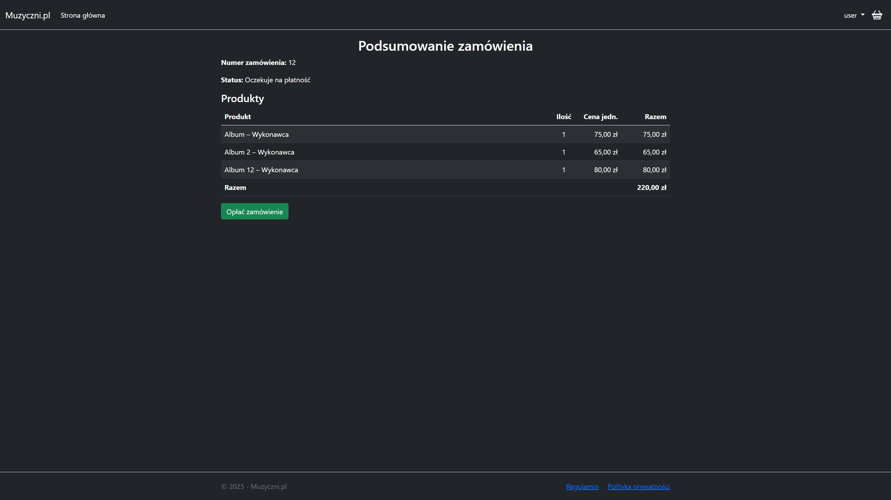</p>
<p>Po potwierdzeniu płatności zamówienie jest oznaczane jako opłacone, a system generuje paragon, który można pobrać klikając przycisk "Pobierz paragon".</p>
<p>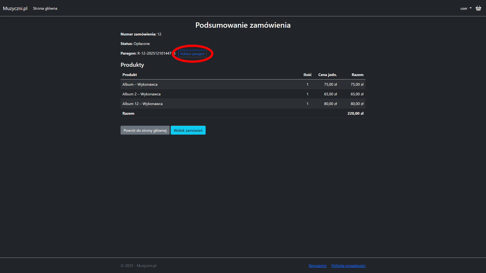</p>
<p>Tak wygląda przykładowy paragon, jest to plik pdf.</p>
<p>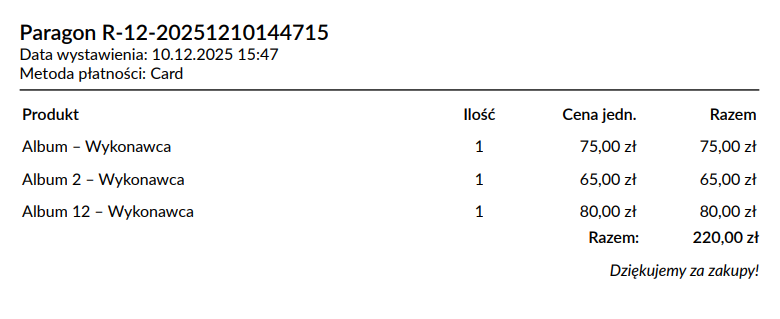</p>
<p>Po złożeniu zamówienia można zawsze przejść do widoku wszystkich swoich zamówień, poprzez rozwinięcie listy w prawym górnym rogu ekranu i kliknięcie przycisku "Zamówienia"</p>
<p></p>
<p>W panelu zamówień można zobaczyć szczegóły danego zakupu klikając w jego id, zobaczyć jego status, cenę, datę zamówienia oraz datę dostarczenia</p>
<p>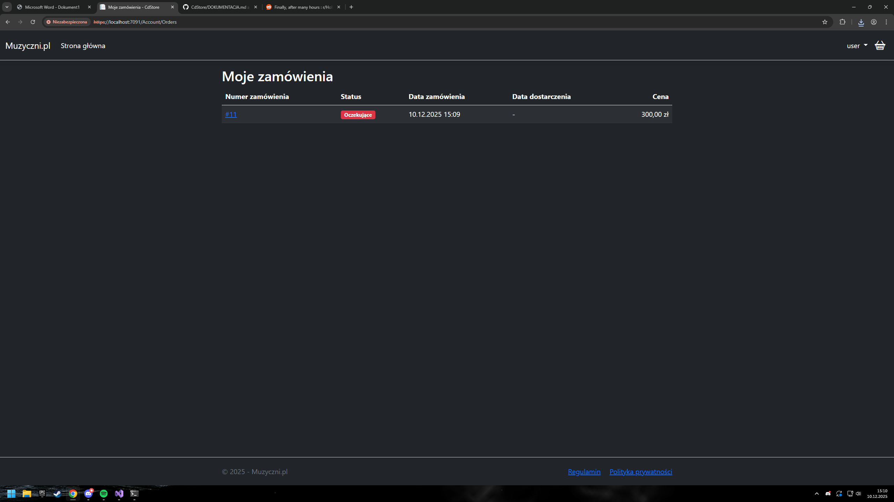</p>

<h2>Operacje administratora — krok po kroku (bez kodu)</h2>

<p>W tej sekcji znajdują się opisy kroków, jakie wykonuje administrator w aplikacji. Nie ma tu fragmentów kodu — tylko instrukcje operacyjne.</p>

<h3>Dodawanie / edycja albumu</h3>
<p>W panelu administracyjnym możesz dodać nowy album oraz edytować istniejące wpisy. Formularze admina umożliwiają ustawienie tytułu, artysty, ceny, gatunku, opisu, ilości na stanie i linku do okładki.</p>
<p>Aby przejść do panelu albumów należy rozwinąć listę w lewym górnym rogu ekranu i kliknąć przycisk "Albumy"</p>
<p>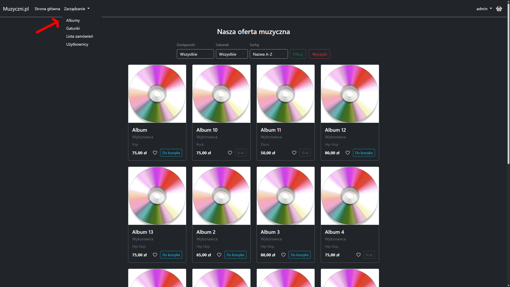</p>
<p>Widok albumów</p>
<p>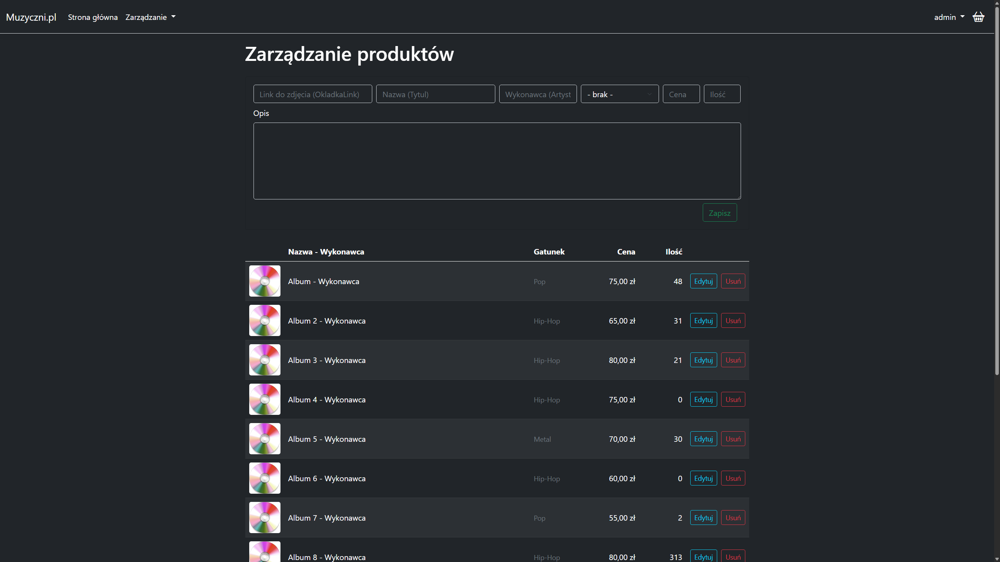</p>
<p>Aby dodać nowy album, należy użyć formularza na górze strony</p>
<p>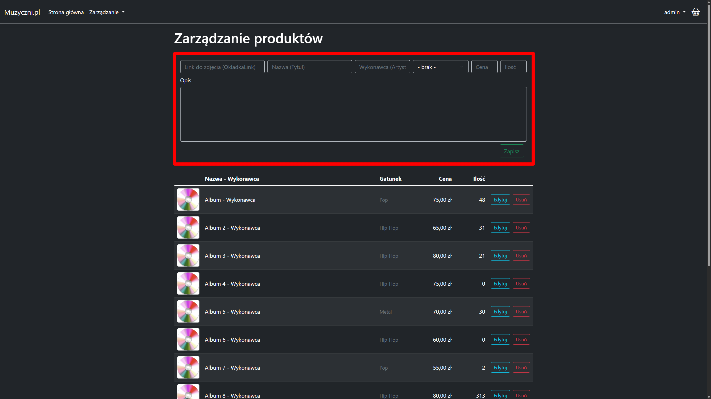</p>
<p>Aby edytować bądź usunąć album, należy użyć jednego z dwóch przycisków po prawej stronie tabeli</p>
<p>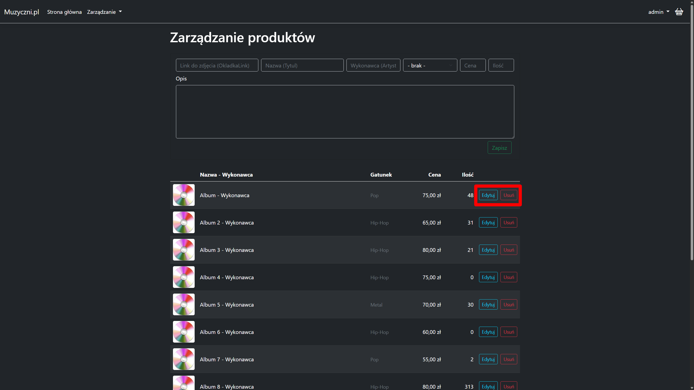</p>

<h3>Dodawanie / edycja gatunku</h3>
<p>W panelu administracyjnym możesz dodać nowy gatunek oraz edytować istniejące wpisy.</p>
<p>Aby przejść do panelu gatunków należy rozwinąć listę w lewym górnym rogu ekranu i kliknąć przycisk "Gatunki"</p>
<p></p>
<p>Widok gatunków</p>
<p>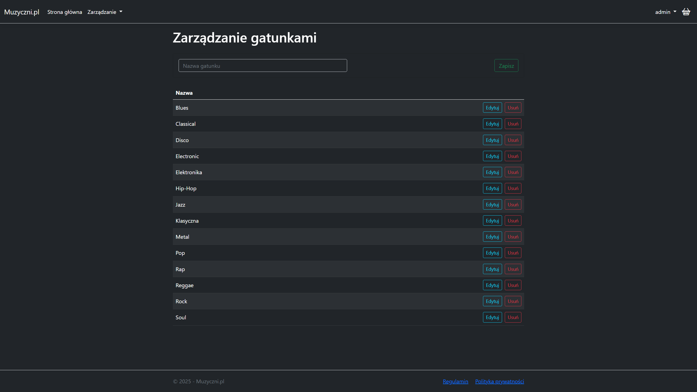</p>
<p>Aby dodać nowy gatunek, należy użyć formularza na górze strony</p>
<p>Aby edytować bądź usunąć gatunek, należy użyć jednego z dwóch przycisków po prawej stronie tabeli</p>

<h3>Blokowanie / odblokowywanie użytkownika</h3>
<p>Na liście użytkowników admini mogą zablokować konto. Zablokowany użytkownik nie może składać zamówień ani wykonywać płatności. Można również przywrócić zablokowane konto, mianować użytkownika adminem oraz odebrać mu uprawnienia admina.</p>
<p>Aby przejść do panelu użytkowników należy rozwinąć listę w lewym górnym rogu ekranu i kliknąć przycisk "Użytkownicy"</p>
<p>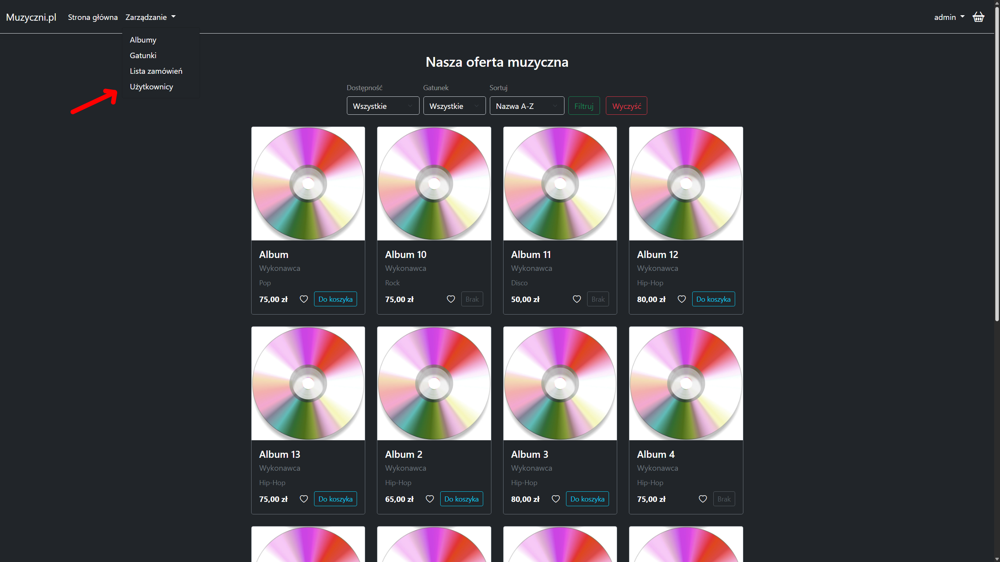</p>
<p>Aby zablokować, odblokować, mianować adminem lub usunąć upeawnienia admina należy użyć akcji na prawo od użytkownika.</p>
<p>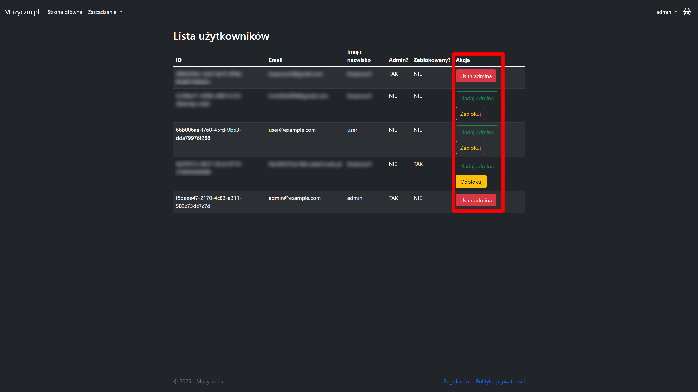</p>

<h3>Zarządzanie zamówieniami</h3>
<p>Ten panel administracyjny pokazuje wszystkie zamówienia; można filtrować po statusie i zmieniać statusy (np. oczekujące, wysłane, dostarczone). Można też zobaczyć szczegóły zamówienia klienta gdzie jets możliwość pobrania paragonu.</p>
<p>Aby przejść do panelu zamówień należy rozwinąć listę w lewym górnym rogu ekranu i kliknąć przycisk "Lista zamówień"</p>
<p>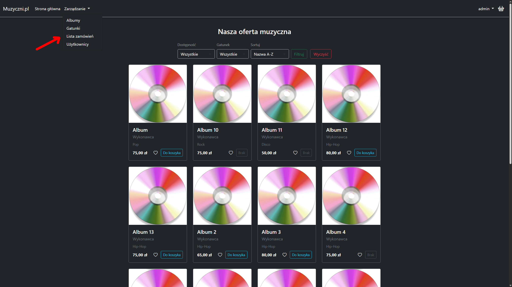</p>
<p>Aby zmienić status zamówienia należy wybrać jedną z opcji w liście rozwijanej po prawej stronie tabeli</p>
<p>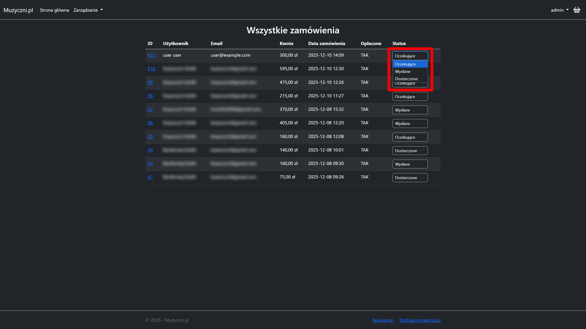</p>

<h2>Uwagi końcowe</h2>

- Dopasuj zrzuty ekranu do ścieżek podanych w komentarzach.
- Integracja płatności i bardziej zaawansowane operacje (PDF, zewnętrzne API) wymagają dodatkowych zależności.

<h2>Kontakt i rozwój</h2>

Projekt znajduje się w repozytorium: https://github.com/Kszaczuch/CdStore (remote origin). Wszelkie zmiany zgłaszać przez pull requesty; do dyskusji używać issues w repozytorium.

<h2>Lista najważniejszych plików do szybkiego przeglądu</h2>

- Program.cs
- Services/ApplicationDbContext.cs
- Services/SeedService.cs
- Services/CartService.cs
- Controllers/AccountController.cs
- Controllers/HomeController.cs
- Controllers/OrderController.cs
- Models/Users.cs, Album.cs, Order.cs, OrderItem.cs
- Views/* (szczególnie Views/Account i Views/Order)
